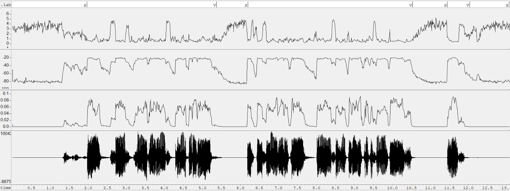
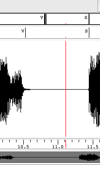
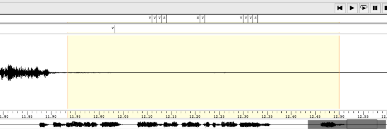
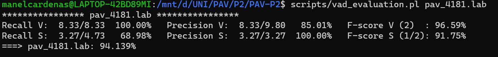
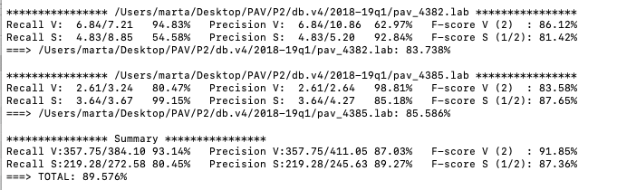
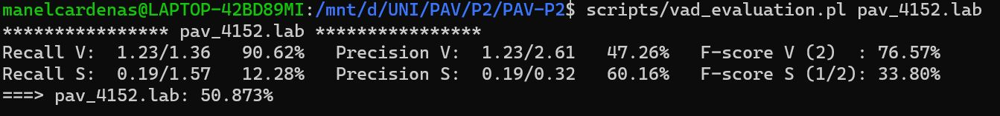

PAV - P2: detección de actividad vocal (VAD)
============================================

>Introducción

Ejercicios
----------

### Etiquetado manual de los segmentos de voz y silencio

- Etiquete manualmente los segmentos de voz y silencio del fichero grabado al efecto. Inserte, a 
  continuación, una captura de `wavesurfer` en la que se vea con claridad la señal temporal, el contorno de
  potencia y la tasa de cruces por cero, junto con el etiquetado manual de los segmentos.

>Empezando por la gráfica de arriba, el orden es el siguiente: ZCR, POT, AMP y señal .wav. Hemos usado el algoritmo de las práctica 1 para obtener las gráficas. 

- A la vista de la gráfica, indique qué valores considera adecuados para las magnitudes siguientes:

	* Incremento del nivel potencia en dB, respecto al nivel correspondiente al silencio inicial, para
	  estar seguros de que un segmento de señal se corresponde con voz.

	* Duración mínima razonable de los segmentos de voz y silencio.

	* ¿Es capaz de sacar alguna conclusión a partir de la evolución de la tasa de cruces por cero?

### Desarrollo del detector de actividad vocal

- Complete el código de los ficheros de la práctica para implementar un detector de actividad vocal tan
  exacto como sea posible. Tome como objetivo la maximización de la puntuación-F `TOTAL`.

- Inserte una gráfica en la que se vea con claridad la señal temporal, el etiquetado manual y la detección
  automática conseguida para el fichero grabado al efecto. 

- Explique, si existen. las discrepancias entre el etiquetado manual y la detección automática.

>Como podemos observar en la siguiente captura, a veces hay una breve diferencia temporal entre la manual (la transcription inferior) y la automática (la superior) y a veces no existe una diferencia notable. No pensamos que dicha diferencia influya demasiado en el correcto funcionamiento de nuestro programa.

Lo que si que repercute es que, algunas veces, sin practicamente haber fluctuaciones en el audio, se produce el siguiente fenómeno

>Como vemos, en el trascription automático se puede apreciar unos cambios de estado sin sentido. 

- Evalúe los resultados sobre la base de datos `db.v4` con el script `vad_evaluation.pl` e inserte a 
  continuación las tasas de sensibilidad (*recall*) y precisión para el conjunto de la base de datos (sólo
  el resumen).

>Como se puede ver, en nuestro audio tenemos una tasa de acierto bastante elevada (94.139%) esto es debido a que grabamos un audio sin apenas ruido de fondo y sin demasiadas “complicaciones” para el programa como por ejemplo palabras acabadas en oclusivas o silencios muy cortos o tramas de voz también cortas, como explicaremos más adelante, cualquiera de las características anteriores puede llegar a repercutir mucho a la hora de analizar una señal.
Por otra parte, analizando la sensibilidad y la precisión, podemos apreciar como el porcentaje de la precisión es más elevado que el de la sensibilidad, pero en ambos casos el porcentaje final es bastante elevado. Más adelante y teniendo en cuenta el resto de ficheros .wav analizaremos más detenidamente la sensibilidad y precisión de nuestro algoritmo.

>El resultado final de analizar todos los ficheros de la carpeta db.v4 es de 89.576% que pese a ser un valor bastante elevado, no es tan óptimo como desearíamos o como hemos obtenido en nuestro fichero .wav esto es debido a bastantes elementos.

>Empezaremos hablando de la sensibilidad y precisión del algoritmo, tras analizar todos los ficheros, consideramos que donde más problemas aparecen es en la sensibilidad, entendemos que pueda ser así ya que uno de los mayores problemas que consideramos que tiene nuestro algoritmo es la no identificación de consonantes oclusivas, muchas de las veces que se acaba una palabra con este tipo de fonemas, nuestro algoritmo no está totalmente implementado para identificarlo y los considera como Silence cuando en realidad es trata de Voice, por este motivo la sensibilidad en algunos ficheros con bastantes palabras acabadas en estos fonemas pueden presentar una tasa de sensibilidad muy baja(más adelante exponemos un ejemplo). Por otro lado, el ruido de fondo también repercute negativamente en nuestro algoritmo, al no haber llegado a desarrollar de forma total los umbrales, si un pico de ruido los supera, podría llegar a ser considerado como Voz en vez de Silencio y esto también afecta a la hora de obtener la tasa de la sensibilidad. Como se pide en la Ampliación 1, una muy buena opción hubiese sido poner todas las tramas de Silencio a 0 para así conseguir una mayor claridad entre Silencio y Voz y que ningún pico de ruido se acercara a los umbrales, pero eso lo explicaremos más detalladamente en la Ampliación 1.

>Por lo que a la precisión respecta, las dificultades también van mucho en la misma línea que con la sensibilidad, pero como acertamos muchas más tramas de las que erramos, la precisión es más fácil de conseguir un valor elevado( siempre y cuando el fichero sea un poco largo).
Otros aspectos que nos gustaría tener en cuenta es que sin llegar a estar implementado totalmente, deseábamos que nuestro algoritmo fuese capaz de detectar destellos de ruido y no considerarlos como Voz, el razonamiento que hemos intentado llevar a cabo, es que si una trama de Voz de duración muy reducida se encontraba entre tramas de Silencio, claramente se debería tratar de una falsa alarma(destello de ruido) y pese a que se pudiera llegar a interpretar como Voz, ya que superarse el umbral, teniendo en cuenta que se encuentra entre tramas de Silencio y que su duración es muy reducida,se debería considerar como una trama de Silencio y no como Voz.

>Hemos analizado un audio del cual tenemos una tasa de acierto muy baja (50.873%). 

>El audio es la siguiente frase:

*HOLA SÓC L’ALBERT.*

>Uno de los motivos de tener una baja tasa de aciertos sería que una de las solo 3 palabras que forman el audio, acaba en oclusiva \[t] (concretamente sorda). Las consonantes oclusivas tienen la característica de que provocan una breve interrupción en la señal de voz, por lo tanto el programa lo suele interpretar como silencio, aunque forme parte de la voz. Además, que una de las únicas 3 palabras que se dicen en el audio, sea oclusiva y sorda, baja mucho la tasa de acierto. 	

### Trabajos de ampliación

#### Cancelación del ruido en los segmentos de silencio

- Si ha desarrollado el algoritmo para la cancelación de los segmentos de silencio, inserte una gráfica en
  la que se vea con claridad la señal antes y después de la cancelación (puede que `wavesurfer` no sea la
  mejor opción para esto, ya que no es capaz de visualizar varias señales al mismo tiempo).

#### Gestión de las opciones del programa usando `docopt_c`

- Si ha usado `docopt_c` para realizar la gestión de las opciones y argumentos del programa `vad`, inserte
  una captura de pantalla en la que se vea el mensaje de ayuda del programa.

### Contribuciones adicionales y/o comentarios acerca de la práctica

- Indique a continuación si ha realizado algún tipo de aportación suplementaria (algoritmos de detección o 
  parámetros alternativos, etc.).

- Si lo desea, puede realizar también algún comentario acerca de la realización de la práctica que
  considere de interés de cara a su evaluación.

Recuerde comprobar que el repositorio cuenta con los códigos correctos y en condiciones de ser 
correctamente compilados con la orden `meson bin; ninja -C bin`. El programa generado (`bin/vad`) será
el usado, sin más opciones, para realizar la evaluación *ciega* del sistema.
